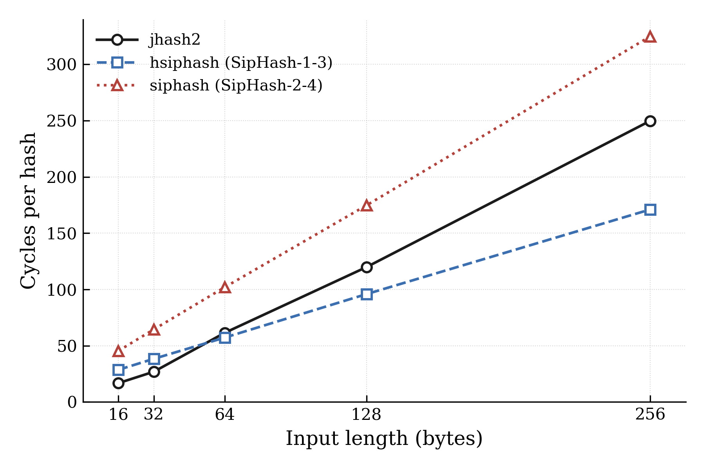
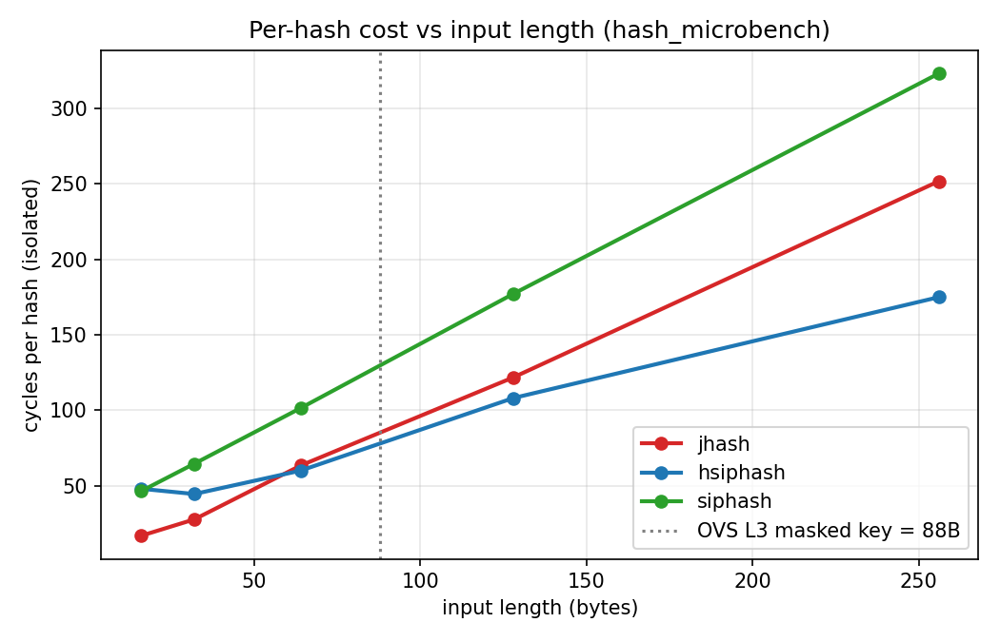
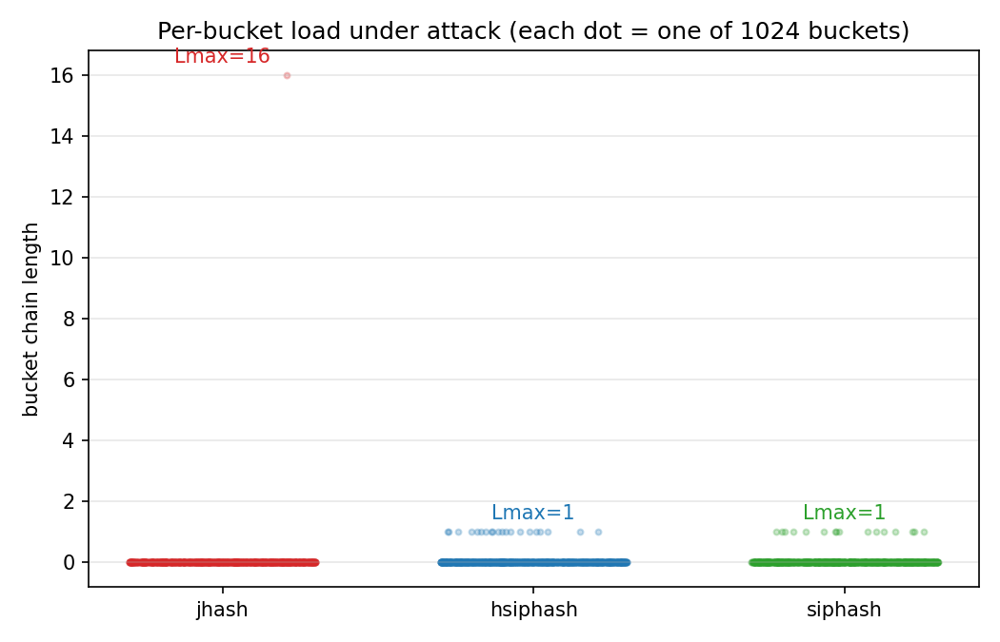
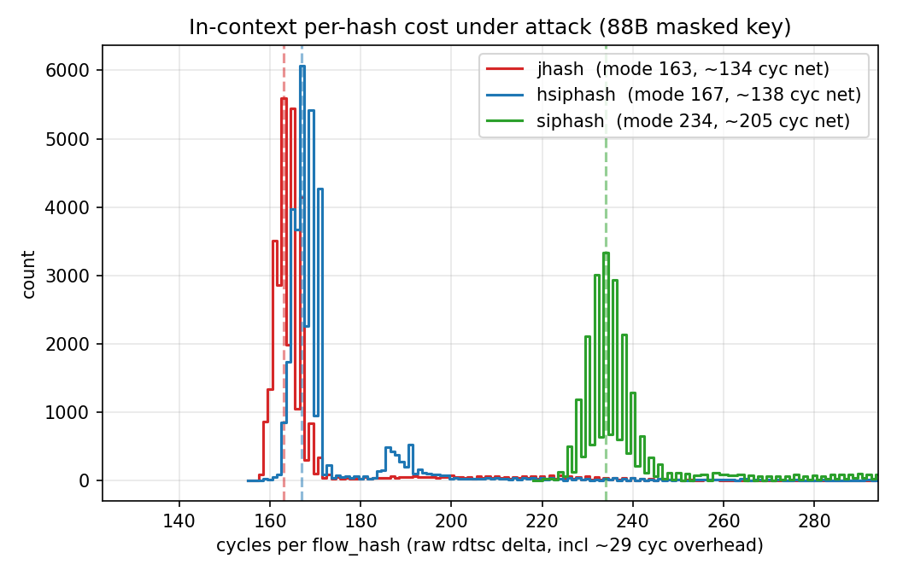

<!-- 版面樣式集中於 global-bottom.vue（每頁載入的全域樣式）。
     Slidev 會把 markdown 內的 <style> 限定在單一頁（scoped），故不在此定義，改樣式請編輯 global-bottom.vue。 -->

<div class="cover-title">

# OVS flow table 雜湊函式：效能與 HashDoS 安全性分析

<div class="cover-subtitle">

OVS kernel datapath 的 <code>flow_hash()</code> 該不該把 <code>jhash2</code> 換成 keyed hash？

Experiment 1 – 3 整體回顧：從純函式成本、真實 datapath 整合，到 HashDoS 攻防

</div>

<div style="margin-top: 26px">

<span class="tag">Linux kernel datapath</span>
<span class="tag">Open vSwitch</span>
<span class="tag">HashDoS</span>
<span class="tag">jhash2 / hsiphash / siphash</span>
<span class="tag">kernel patch</span>

</div>

</div>

<div class="foot">yhsindev</div>

---

# 破題：從一個 2026 年的 CVE 說起

jq（常用的命令列 JSON 處理器）在 2026 年出現 **CVE-2026-40164**。

它的 JSON object 雜湊表使用 MurmurHash3，而且搭配一個**公開且寫死**的 seed `0x432A9843`。由於這個 hash mapping 可以被離線預測，攻擊者能事先構造出大量會落入**同一個 bucket** 的 JSON keys；只要約 **100 KB** 的 crafted JSON，就足以讓 hash table lookup 從 $O(1)$ 退化為 $O(n)$，使整條處理呈現 $O(n^2)$ 等級的 CPU 耗盡。

<div class="box">

這不是只存在於早期文獻的問題。「**固定、公開的 non-cryptographic 雜湊 seed + 外部可控的 key**」在現代軟體中仍會造成 algorithmic complexity DoS。

</div>

<div class="insight">

OVS kernel datapath 的 <code>flow_table.c::flow_hash()</code> 正是用 <code>jhash2(..., 0)</code> —— <strong>同一個風險模式</strong>。這就是本研究的起點。

</div>

---

# 研究問題：jhash2 該不該換成 keyed hash？

現行 <code>flow_hash()</code> 使用 <code>jhash2(..., seed=0)</code>：non-keyed、seed 固定、輸出可預測。是否換成 keyed 雜湊函式（<code>hsiphash</code> / <code>siphash</code>），必須拆成**兩件彼此獨立**的事來回答。

<div class="grid2">
<div class="box">

### 安全性軸（與輸入長度無關）

seed=0 的 jhash2 可被離線重算，理論上可被 hash-flooding 攻擊；keyed 雜湊函式的 mapping 依賴開機隨機金鑰，破壞攻擊者的**離線可預測性**。

<div class="small accent">由實驗三回答</div>

</div>
<div class="box">

### 效能軸（取決於真實輸入長度）

三種雜湊函式的**相對成本會隨被雜湊的 key 長度改變**，因此「換了會不會變慢」取決於 <code>flow_hash()</code> 真實看到的輸入長度。

<div class="small accent">由實驗一、二回答</div>

</div>
</div>

<div class="insight">

全篇的技術主線：<strong>把兩軸分開量、分開論證</strong>，最後再合流，判斷是否構成送出 kernel patch 的依據。

</div>

---

# 三個比較對象

| 雜湊函式 | 性質 | 在本研究的定位 |
|---|---|---|
| `jhash2()` | non-cryptographic、**unkeyed**、seed 固定為 0 | OVS 現行 baseline |
| `hsiphash()` | **keyed**；x86-64 上實作為 SipHash-1-3 | 輕量 keyed hash，安全與效能的中間點 |
| `siphash()` | **keyed** PRF（SipHash-2-4），64-bit 輸出 fold 成 32-bit | 較強的 keyed PRF baseline |

<div class="insight">

關鍵平台差異：<code>hsiphash</code> 在 <strong>64-bit 平台是 SipHash-1-3</strong>，不是 32-bit 平台的 HalfSipHash。這個差異在最後的成本結論與適用範圍會反覆出現。

</div>

---

<div class="sec">
<div class="secnum">EXPERIMENT 1</div>
<div class="sectitle">先隔離雜湊函式本身的成本</div>
<div class="secsub">在碰 OVS 之前，量純函式對輸入長度的成本曲線</div>
</div>

---

# 實驗一：kernel-side microbenchmark

以 out-of-tree kernel module 實作，**直接呼叫核心內部的雜湊函式**，避免 user-space 測試後移植回核心的環境落差。

<div class="grid2">
<div>

```bash
sudo insmod ./hash_microbench.ko \
  hash_type=0 \
  input_len=64 \
  iterations=10000000
```

以 `rdtsc_ordered()` 夾住緊迴圈，得到每次雜湊的 cycles；再用分組的 `perf stat` 量 instructions 與 branch/cache misses。分組的目的是避開 PMU 的 time multiplexing，使量測達到 `100% counted`。

</div>
<div class="small">

三種雜湊函式的輸入型態不同，比較之前必須先對齊基準。`jhash2` 的長度單位是 u32 words，SipHash 系列則以 byte buffer 為輸入，因此 `input_len` 必須取 4 位元組的倍數才公平。`siphash` 回傳 64-bit，而 OVS 的 hash path 是 32-bit，所以再以 XOR 折疊成 32-bit，這段折疊成本也一併納入量測窗。

之所以先把雜湊函式隔離出來，是為了不在一開始就把 flow lookup、RCU、softirq 與 cache locality 混在一起解讀。

</div>
</div>

---

# 實驗一結果：排序會隨輸入長度反轉

<div class="figrow">
  <div class="figcol">
    
    <div class="figcap">cycles/hash 對輸入長度（16–256 位元組），kernel 6.8.0-111、i5-10500。</div>
  </div>
  <div class="figtxt small">
    <p><code>siphash</code> 在所有長度都最貴，這是最穩固的不變量。<code>jhash2</code> 只在 <b>32 位元組以下</b>最便宜；到了大約 <b>64 位元組</b>會出現交叉點，一旦輸入更長，keyed 的 <code>hsiphash</code> <b>反而比 unkeyed 的 jhash2 便宜</b>。</p>
    <div class="insight"><strong>「jhash 最快、所以不能換」這個假設，只在短輸入成立。</strong>合理的解釋是：jhash2 的成本隨長度線性累積得快，而 hsiphash 固定啟動成本較高、但每位元組成本較低。</div>
  </div>
</div>

---

<div class="sec">
<div class="secnum">EXPERIMENT 2</div>
<div class="sectitle">把成本放回真實 OVS datapath</div>
<div class="secsub">從純函式的 microbenchmark 推進到 integration 層級</div>
</div>

---

# `flow_hash()` 在哪裡、為什麼值得問

OVS megaflow 查找（tuple-space search）在 <code>flow_table.c::flow_hash()</code> 中，對封包的 masked key 呼叫 <code>jhash2(..., 0)</code>。

<div class="box">

核心其他**安全敏感、而且會處理外部可控輸入**的雜湊使用點，早已改用 keyed 的 SipHash 系列，例如封包導向的 <code>__skb_get_hash</code>（flow dissector）、socket 查找，以及 TCP 初始序號（<code>secure_seq.c</code>）。OVS 的 <code>flow_hash()</code> **性質完全相同，只是目前還沒做同樣的處理**。

</div>

研究問題（實驗二）：

> 在真實 OVS datapath 的 <code>flow_hash()</code>，把 <code>jhash2</code> 換成 keyed 的 <code>hsiphash</code> / <code>siphash</code>，**integration 層級的成本是多少**？

---

# 方法學：怎麼公平量到「雜湊函式本身」

<div class="small">

要公平量到雜湊函式本身的成本，不能直接比 perf 的 flat symbol，因為三者的編譯型態並不相同：`jhash2` 是 `static inline`，成本藏在呼叫者的 self，而 SipHash 系列是 out-of-line symbol（`__hsiphash_unaligned` / `__siphash_unaligned`）。更隱蔽的問題是 symbol 撞名——在原始碼根本沒有 siphash 的 `jhash` build 下，perf 竟然也出現 `__siphash_unaligned` 佔 14.68%，其實那是核心自己的 `__skb_get_hash` flow dissector 用了同一個 symbol。

</div>

```text
--14.68%--__siphash_unaligned
          |--9.51%--ovs_flow_hash_backend    ← 我們的 flow_hash()
          |          masked_flow_lookup ...
           --5%----__skb_get_hash            ← 核心 flow dissector，與 OVS 無關
```

<div class="insight">

解決方式是在 <code>flow_hash()</code> 與雜湊函式之間插入一個 <code>noinline</code> 的包裝函式 <code>ovs_flow_hash_backend()</code> 當作統一量測點，只取它的 <strong>children%（也就是 caller-edge 歸屬）</strong>，掛在別的 parent 底下的 <code>__skb_get_hash</code> 就會自動被排除。雜湊函式的身分則以 <code>nm -u</code> 驗證，因為 srcversion 只是 per-build 的 MD5，指不出是哪一種雜湊。如果直接讀 flat symbol，siphash 會被高估約 <strong>50%</strong>。

</div>

---

# 實驗二結果（88 位元組輸入）：keyed 不一定比較貴

| 雜湊函式 | `ovs_flow_hash_backend` children% (N=10) | 每次呼叫估計成本 |
|---|---|---|
| **hsiphash** | 5.65 ± 0.12 | **約 71 cycles** |
| jhash | 9.50 ± 0.14 | 約 124 cycles |
| siphash | 9.95 ± 0.13 | 約 133 cycles |

成本排序 **hsiphash < jhash < siphash**。keyed 的 hsiphash 比現行 jhash 還便宜約四成，完整的 siphash 也只貴約 8%。

<div class="box warn">

但這裡要誠實面對一點：這個 88 位元組，是由我自己設計的 D-v3B 工作負載所產生的。我不能用一個**刻意設計成長輸入的負載，去證明真實輸入很長**，那會是循環論證。真實的輸入長度，必須用真實 controller 產生的規則來量測。

</div>

---

# 真實輸入長度：在本機架 OVN 自己產生 megaflow

<div class="figrow">
  <div class="figcol">
    
    <div class="figcap">實驗一曲線，虛線標出真實 OVN 的 88 位元組 masked key 落點。</div>
  </div>
  <div class="figtxt small">
    <p>我在核心裡以 debugfs 直方圖，就地量測每次 <code>flow_hash()</code> 的 <code>range_n_bytes</code>。stateless 的 IPv4 流量，不論走 L2 還是經 router 的 L3、不論 TCP／UDP／ICMP、位址是 exact 還是 wildcard，長度都是單一值 <b>88 位元組</b>；一旦啟用 stateful ACL（conntrack），post-conntrack 的 lookup 會變成 <b>160 位元組</b>，且雙向 ACL 下 88 與 160 的呼叫次數比恰為 <b>1：2</b>。</p>
    <div class="insight">關鍵在於，長度是被「出現哪些協定層、以及是否走 conntrack」量子化成少數離散值，而<strong>不是</strong>被 flow 的精細度決定。因此真實 OVN（例如常用 stateful ACL 的 ovn-kubernetes）會落在 88 位元組以上，也正是 hsiphash 約等於或低於 jhash 的那一側。</div>
  </div>
</div>

---

<div class="sec">
<div class="secnum">EXPERIMENT 3</div>
<div class="sectitle">HashDoS 攻防：安全性軸</div>
<div class="secsub">威脅模型、良性基準、受控實驗，到真實 kernel 重現</div>
</div>

---

# 威脅模型：演算法複雜度攻擊（2003 USENIX）

攻擊成立需要**三個條件**：(1) 雜湊 deterministic 且可被得知；(2) 攻擊者可預測或控制實際送入的輸入；(3) 有足夠多攻擊性輸入進入系統。核心是**成本不對稱**：

<div class="grid2">
<div class="box">

### Unkeyed：可離線構造

因為 $B(x)=H(x)\bmod m$ 可以離線重算，攻擊者能在自己的機器上先篩出會落到同一個 bucket 的 keys，只把精選過的 $K$ 個送進受害端。離線成本約為 $K\cdot m$，而且**完全不消耗受害端的資源**。

</div>
<div class="box">

### Keyed：只能線上嘗試

因為 $B_k(x)=H_k(x)\bmod m$ 依賴祕密金鑰，攻擊者無法離線預測，只能在線上逐一送出候選 keys 嘗試碰撞。此時送出 $Q$ 個候選，能形成的 chain 長度只隨 $\sqrt{Q}$ 成長，而 unkeyed 是隨 $Q$ 成長。

</div>
</div>

<div class="insight">

keyed 雜湊函式的價值**不是讓 collision 不可能發生**，而是<strong>阻止攻擊者離線預先構造 collision set</strong>，把攻擊效果從接近線性壓成平方根級。

</div>

---

# 良性基準：balls-into-bins / Poisson

若雜湊接近均勻 random mapping，$n$ 個 key 丟進 $m$ 個 bucket，單一 bucket 的負載 $L_b \approx \text{Poisson}(\alpha)$，$\alpha=n/m$。

嚴重的 bucket 群聚**不會在良性輸入中自然出現**，因為 $n$ 個 key 全部落在某一個桶的機率只有約 $1/m^{n-1}$。因此，如果觀察到 $L_{\max}$（最長 chain）明顯高於對數級的 baseline，就應該把它當成 **adversarial input 的結果**，而不是自然變異。

<div class="box">

三個安全性指標：**maximum bucket load** $L_{\max}$（最壞查找長度）、**collision count** $C=\sum_b\binom{L_b}{2}$、**normalized entropy** $H_{\text{norm}}$（分佈是否均勻，1 = 均勻、0 = 全部集中）。

</div>

---

# 受控實驗：先在乾淨 hash table 隔離觀察

設定 $n=m=4096$、$\alpha=1$，五組 flow key set 餵入三種雜湊函式（下表以 jhash2 為代表）：

| key set | $L_{\max}$ | $C$ | $E[C]$ | $H_{\text{norm}}$ |
|---|---:|---:|---:|---:|
| random / seq_ip / fixed_dst / vary_srcport | 6–7 | ≈ 2047 | 2047 | ≈ 0.93 |
| **collision-vs-jhash**（針對 jhash2 離線構造） | **4096** | **8,386,560** | 2047 | **0.0000** |

四組良性輸入符合 Poisson(1)（$\chi^2=4.96 < 11.07$）。只有針對 jhash2 mapping 離線構造的 key set 讓表退化成單一 bucket。

<div class="insight">

把同一組 collision keys 換成 keyed hash 之後，<code>hsiphash</code> 與 <code>siphash</code> 的 $L_{\max}$ 立刻回到 <strong>7</strong>、$H_{\text{norm}}$ 回到約 0.93，也就是<strong>重新分散開來</strong>。而離線構造這組 keys 實測用了 16,579,328 次嘗試，與理論的 $K\cdot m$ = 16,777,216 相當接近。

</div>

---

# OVS 案例：兩段雜湊，攻擊面在哪？

<div class="figrow">
<div class="pathflow">
  <div class="pbox">封包的 <code>sw_flow_key</code></div>
  <div class="parrow"><span class="lbl"><code>ovs_flow_mask_key()</code>：套用 mask，清掉 wildcard 位元</span><span class="tri">▼</span></div>
  <div class="pbox">masked key（<b>88 位元組</b>）</div>
  <div class="parrow attack"><span class="lbl">第 1 段 <code>flow_hash()</code> ＝ <b>jhash2(seed=0)</b>　← 攻擊面</span><span class="tri">▼</span></div>
  <div class="pbox">32-bit hash</div>
  <div class="parrow"><span class="lbl">第 2 段 <code>find_bucket()</code>：加上 per-table 隨機 seed、動態 resize</span><span class="tri">▼</span></div>
  <div class="pbox">命中 bucket，走訪 hlist chain（probe count）</div>
  <div class="parrow"><span class="lbl">正常 O(1)；碰撞下 O(chain 長度)</span><span class="tri">▼</span></div>
  <div class="pbox danger">最壞：長度 K 的 chain</div>
</div>
<div class="small">

第 2 段的隨機 seed 加上動態 resize，使得任何 bucket collision 都不穩定：攻擊者既不知道 seed，resize 之後又會被打散。真正與 seed、resize 都無關的，只有**完整的 32-bit hash collision**。換句話說，隨機 seed 的作用不是把 bucket 藏起來，而是把攻擊者所需的**碰撞寬度**從 $\log_2 m = 15$ bits 提高到完整的 **32 bits**。

<div class="insight">

為了確認離線模型忠實，我取了 64 筆真實的 (masked-key, kernel hash)，用離線 jhash2 逐位元重算，結果 <strong>64 筆全部吻合</strong>，代表離線構造出的碰撞植入之後，確實會在真實表成立。

</div>

</div>
</div>

---

# 在真實 kernel datapath 重現 HashDoS（K=16）

<div class="figrow">
  <div class="figcol">
    
    <div class="figcap">攻擊下每個 bucket 的 chain 長度；jhash 單桶衝到 16，keyed 全部 ≤ 1。</div>
  </div>
  <div class="figtxt small">
    <p>我在攻擊者可控的欄位（src／dst IP）上離線暴力搜尋，找出 <b>16 個 <code>flow_hash</code> 全部等於 <code>0xcaa92980</code></b> 的 key，再轉成 16 條 exact-match 的 OpenFlow 規則植入 <code>br0</code>。結果這 16 條 flow 串成單一 bucket 的 chain：L<sub>max</sub>＝16、C＝120＝C(16,2)；H<sub>norm</sub> 從 baseline 的 0.94 降到約 0.03，動態 probe count 也從 ≤1 上升到 <b>16</b>。</p>
    <div class="insight">這就是最壞情況（從 O(1) 退化為 O(K)）在真實 datapath 重現，而且因為瞄準的是<strong>完整 hash collision</strong>，與 seed、resize 都無關。K＝16 只是結構性示範，OVS 的 masked-key entropy budget 有限，未規模化到大 K。</div>
  </div>
</div>

---

# Keyed hash 防禦與成本取捨

<div class="figrow">
  <div class="figcol">
    
    <div class="figcap">攻擊下 in-context per-hash 成本（88 位元組 masked key）。</div>
  </div>
  <div class="figtxt small">
    <p>在安全性上，把同一組（針對 jhash 構造的）keys 分別餵入三種雜湊函式：jhash 仍然是 L<sub>max</sub>＝16，但 hsiphash 與 siphash 都回到 L<sub>max</sub>＝1、16 個 hash 全不相同，攻擊直接失效。在效能上，三者在 88 位元組的 in-context per-hash 成本分別約為 jhash 134、hsiphash 138、siphash 205 cycles。</p>
    <div class="insight"><code>hsiphash</code> 在 x86-64 是 SipHash-1-3，成本幾乎等於 jhash，卻提供 keyed 防禦。keyed 多付的固定 per-hash 開銷（hsiphash 近乎零、siphash ＋50%），遠小於它擋掉的 chain-walk。<strong>成本的分水嶺在於「是否帶祕密金鑰」，而不是 round 數。</strong></div>
  </div>
</div>

---

<div class="sec">
<div class="secnum">SYNTHESIS</div>
<div class="sectitle">兩軸合流與推廣</div>
</div>

---

# 兩條軸線合流：該不該送 patch？

<div class="grid2">
<div class="box">

### 安全性軸（成立）

與輸入長度無關。seed=0 的 jhash2 可離線構造碰撞、在真實 datapath 已重現；keyed hash 破壞離線可預測性。**此理由在任何長度都成立。**

</div>
<div class="box">

### 效能軸（在真實區間成立）

真實 OVN 輸入落在 **88 / 160 位元組**（stateful 佔多數），正是 hsiphash ≈ 或 < jhash 的區間。**在此區間換成 keyed hash 不會變慢。**

</div>
</div>

<div class="insight">

由於兩條軸線同時支持，將 <code>flow_hash()</code> 的第 1 段改為 keyed hash（在 64-bit 平台選 <code>hsiphash</code>），就是一個<strong>低成本、又能擋下 HashDoS</strong> 的改動，構成了 kernel patch 的依據。

</div>

<div class="small warn">

誠實保留：若某真實部署的輸入 < 64 位元組，效能論點反轉，論述保守收斂為「僅具安全性理由」。

</div>

---

# 不只是 OVS：一套通用的分析 workflow

這套分析可以從 jq 的 CVE（問題被發現），延伸到 OVS（本研究的第一個 case study），再推廣到其他同樣用 hash table 處理 untrusted input 的專案，例如 JSON parser、命令列工具、log processor 與 network daemon。

<div class="box">

重點是判斷風險層級，而不是盲目地替換 hash 函式。具體要問三個問題：

1. 這個雜湊是否處理 **untrusted input**？
2. 它的 mapping 是否**可以離線預測**（固定 seed 加上 non-cryptographic）？
3. 攻擊者的 **entropy budget**，是否足以構造出足量的碰撞？

</div>

貢獻：可重複的 adversarial key 產生法，以及 unkeyed vs keyed 在 $L_{\max}$、collision count、entropy、probe count 上的量化對比方法。

---

# 範圍限定（誠實）

- 本實驗的 $K=16$ 只是**結構性示範**，並未掃到大 $K$；OVS 的 masked-key entropy budget 與 megaflow 機制，使得構造大 $K$ 的邊際資訊有限。
- **hsiphash 的安全性與平台有關**：在 x86-64 上是較強的 SipHash-1-3，在 32-bit 平台則是較弱的 HalfSipHash，因此本結論僅限 64-bit。
- per-hash 成本是在 DEBUG 樁仍在執行的 **in-context mode** 下量到的，並非乾淨的 throughput benchmark。
- 結論只適用於**核心 datapath**（`openvswitch.ko`）；DOCA、硬體卸載、netdev 與 TC-flower 都不會走這個 `flow_hash()`。
- 本研究的防禦針對的是「**離線預先構造碰撞**」這個威脅；key-recovery 或 online adaptive 等更強的模型不在範圍內。

---

# 結語

本研究把「要不要換掉 jhash」這個問題，拆成安全與效能兩條彼此獨立的軸，分別用實驗一、二回答效能，用實驗三回答安全。

在效能上，三種雜湊函式的排序會隨輸入長度反轉（交叉點約在 64 位元組），而真實 OVN 的輸入落在 keyed hash 仍有競爭力的 88 與 160 位元組區間。在安全上，我在真實 kernel datapath 重現了 HashDoS，並確認 keyed hash 的價值在於破壞離線可預測性，成本的分水嶺在於「是否帶祕密金鑰」，而不是 round 數。

<div class="insight">

結論：將 OVS <code>flow_hash()</code> 改用 keyed hash 是<strong>低成本、可擋、有依據</strong>的改動；同一套分析也可推廣成通用的 hash-table 安全性檢查 workflow。

</div>

<div class="foot">Experiment 1 – 3 · yhsindev</div>
